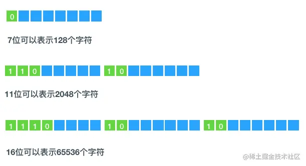

# 变量、常量、类型

## 变量的声明与使用

变量指定了某存储单元（Memory Location）的名称，该存储单元会存储特定类型的值。Go语言中的变量需要声明后才能使用，同一作用域内不支持重复声明。 并且Go语言的变量声明后必须使用。

在 Go 中，有多种语法用于声明变量。

### 声明单个变量

###### 声明变量

`var 变量名 变量类型 `是声明单个变量的语法。变量声明以关键字`var`开头，变量类型放在变量的后面，行尾无需分号。 举个例子：

```go
var name string
var age int
var isOk bool
```

如果变量未被赋值，Go 会自动地将其初始化，赋值该变量类型的零值（Zero Value）。变量可以赋值为本类型的任何值。

```go
package main

import "fmt"

func main() {
    var age int // 变量声明
    fmt.Println("my age is", age)
    age = 29 // 赋值
    fmt.Println("my age is", age)
    age = 54 // 赋值
    fmt.Println("my new age is", age)
}
```

###### 声明变量并初始化

声明变量的同时可以给定初始值。 `var 变量名 变量类型 = 变量值`的语法用于声明变量并初始化。

```go
var age int = 29 // 声明变量并初始化
```

###### 类型推断

如果变量有初始值，那么 Go 能够自动推断具有初始值的变量的类型。因此，如果变量有初始值，就可以在变量声明中省略 `变量类型type`。

```go
var age = 29 // 可以推断类型age为int类型
```

>编译器推断仅仅是一种缩写（语法糖）不代表该变量没有明确类型。
>
>当前语言规范中，没有只读变量的定义方式。

###### 简短声明

Go 也支持一种声明变量的简洁形式，称为简短声明（Short Hand Declaration），该声明使用了 **:=** 操作符。

声明变量的简短语法是` 变量名:= 变量值`。

```go
package main

import "fmt"

func main() {  
    name, age := "naveen", 29 // 简短声明
    fmt.Println("my name is", name, "age is", age)
}
```

注意：`:=`只能用在函数内部

简短模式（short variable declaration）的限制：

+ 只能用在函数内部
+ 不能提供数据类型
+ 定义时显式初始化

### 声明多个变量

Go 能够通过一条语句声明多个变量。

###### 声明多个变量不初始化

同一类型的多个变量可以声明在同一行：

```go
var name1, name2，... type
```

只能时同一类型的，这是将类型写在标识符后面的一个重要原因

###### 声明时初始化

```go
var name1, name2,... type = initialvalue1, initialvalue2,...
```

仍然只能是同一类型的

###### 自动推导

可以一次定义多个变量，省略类型，用不同的初始值定义不同的类型。这被称为 **并行** 或 **同时** 赋值。

```go
var name1, name2,... = initialvalue1, initialvalue2,...
```

```go
var a1, a2, a3 = 112, "ssss", 55.66
fmt.Print(a1, a2, a3)
```

在函数内部还可以省略`var`，使用`:=`

多变量可以在同一行进行赋值，如：

```go
a, b, c = 5, 7, "abc"
```

上面这行假设了变量 a，b 和 c 都已经被声明，否则的话应该这样使用：

```go
a, b, c := 5, 7, "abc"
```

右边的这些值以相同的顺序赋值给左边的变量，所以 a 的值是 `5`， b 的值是 `7`，c 的值是 `"abc"`。

简短模式并不总是重新定义变量，也可能是部分退化的赋值操作：

退化赋值的前提条件：最少有一个新变量被定义，且必须是同一作用域。

**简短声明的语法要求 := 操作符的左边至少有一个变量是尚未声明的。**

###### 交换两个变量的值

如果你想要交换两个变量的值，则可以简单地使用 `a, b = b, a`。

(在 Go 语言中，这样省去了使用交换函数的必要)

###### 批量声明

每声明一个变量就需要写`var`关键字会比较繁琐，go语言中还支持批量变量声明：

```go
var (
    a string
    b int
    c bool
    d float32
    ...
)
//支持初始化
var (
	//a初始化
	a string = "hello"
	//初始化时也可以省略类型
	b        = 123
	c bool
	d float32
)
```

#### 匿名变量

在使用多重赋值时，如果想要忽略某个值，可以使用`匿名变量（anonymous variable）`。 匿名变量用一个下划线`_`表示。

匿名变量不占用命名空间，不会分配内存，所以匿名变量之间不存在重复声明。 (在`Lua`等编程语言里，匿名变量也被叫做哑元变量。)

注意事项：

1. 函数外的每个语句都必须以关键字开始（var、const、func等）
2. `:=`不能使用在函数外。
3. `_`多用于占位，表示忽略值。

###### Go语言变量的作用域

一个变量（常量、类型或函数）在程序中都有一定的作用范围，称之为作用域。

了解变量的作用域对我们学习Go语言来说是比较重要的，因为Go语言会在编译时检查每个变量是否使用过，一旦出现未使用的变量，就会报编译错误。如果不能理解变量的作用域，就有可能会带来一些不明所以的编译错误。

根据变量定义位置的不同，可以分为以下三个类型：

- 函数内定义的变量称为局部变量
- 函数外定义的变量称为全局变量
- 函数定义中的变量称为形式参数

## 常量

Go语言中的常量使用关键字 const 定义，用于存储不会改变的数据，常量是在编译时被创建的，即使定义在函数内部也是如此，并且只能是布尔型、数字型（整数型、浮点型和复数）和字符串型。由于编译时的限制，定义常量的表达式必须为能被编译器求值的常量表达式。 

常量的声明和变量声明非常类似，只是把`var`换成了`const`，常量在定义的时候必须赋值。

```go
const b string = "abc"
```

常量也可以使用省略类型说明符，编译器可以根据其值来推断其类型。

```go
const b = "abc"
```

常量的值必须是能够在编译时就能够确定的，可以在其赋值表达式中涉及计算过程，但是所有用于计算的值必须在编译期间就能获得。

- 正确的做法：

  ```go
  const c1 = 2/3
  ```

- 错误的做法：

  ```go
  const c2 = getNumber() // 引发构建错误: getNumber() 用做值
  ```

和变量声明一样，可以批量声明多个常量：

```go
const (
    e  = 2.7182818
    pi = 3.1415926
)
```

const同时声明多个常量时，如果省略了值则表示和上面一行的值相同。 例如：

```go
const (
    n1 = 100
    n2
    n3
)
```

上面示例中，常量`n1`、`n2`、`n3`的值都是100。

所有常量的运算都可以在编译期完成，这样不仅可以减少运行时的工作，也方便其他代码的编译优化，当操作数是常量时，一些运行时的错误也可以在编译时被发现，例如整数除零、字符串索引越界、任何导致无效浮点数的操作等。

常量间的所有算术运算、逻辑运算和比较运算的结果也是常量，对常量的类型转换操作或以下函数调用都是返回常量结果：len、cap、real、imag、complex 和 unsafe.Sizeof。

因为它们的值是在编译期就确定的，因此常量可以是构成类型的一部分，例如用于指定数组类型的长度：

```go
const IPv4Len = 4
// parseIPv4 解析一个 IPv4 地址 (d.d.d.d).
func parseIPv4(s string) IP {
    var p [IPv4Len]byte
    // ...
}
```

一个常量的声明也可以包含一个类型和一个值，但是如果没有显式指明类型，那么将从右边的表达式推断类型。在下面的代码中，time.Duration 是一个命名类型，底层类型是 int64，time.Minute 是对应类型的常量。

如果是批量声明的常量，除了第一个外其它的常量右边的初始化表达式都可以省略，如果省略初始化表达式则表示使用前面常量的初始化表达式，对应的常量类型也是一样的。例如：

```go
const (
    a = 1
    b
    c = 2
    d
)
fmt.Println(a, b, c, d) // "1 1 2 2"
```

如果只是简单地复制右边的常量表达式，其实并没有太实用的价值。但是它可以带来其它的特性，那就是 iota 常量生成器语法。

### iota 常量生成器

常量声明可以使用 iota 常量生成器初始化，它用于生成一组以相似规则初始化的常量，但是不用每行都写一遍初始化表达式。在一个 const 声明语句中，在第一个声明的常量所在的行，iota 将会被置为 0，然后在每一个有常量声明的行加一。

`iota`在const关键字出现时将被重置为0。const中每新增一行常量声明将使`iota`计数一次(iota可理解为const语句块中的行索引)。 使用iota能简化定义，在定义枚举时很有用。

#### 几个常见的`iota`示例:

使用`_`跳过某些值

```go
const (
		n1 = iota //0
		n2        //1
		_
		n4        //3
	)
```

`iota`声明中间插队

```go
const (
		n1 = iota //0
		n2 = 100  //100
		n3 = iota //2
		n4        //3
	)
	const n5 = iota //0
```

定义数量级 （这里的`<<`表示左移操作，`1<<10`表示将1的二进制表示向左移10位，也就是由`1`变成了`10000000000`，也就是十进制的1024。同理`2<<2`表示将2的二进制表示向左移2位，也就是由`10`变成了`1000`，也就是十进制的8。）

```go
const (
		_  = iota
		KB = 1 << (10 * iota)
		MB = 1 << (10 * iota)
		GB = 1 << (10 * iota)
		TB = 1 << (10 * iota)
		PB = 1 << (10 * iota)
	)
```

多个`iota`定义在一行

```go
const (
		a, b = iota + 1, iota + 2 //1,2
		c, d                      //2,3
		e, f                      //3,4
	)
```

### 无类型常量

Go语言的常量有个不同寻常之处。虽然一个常量可以有任意一个确定的基础类型，例如 int 或 float64，或者是类似 time.Duration 这样的基础类型，但是许多常量并没有一个明确的基础类型。

编译器为这些没有明确的基础类型的数字常量提供比基础类型更高精度的算术运算，可以认为至少有 256bit 的运算精度。这里有六种未明确类型的常量类型，分别是无类型的布尔型、无类型的整数、无类型的字符、无类型的浮点数、无类型的复数、无类型的字符串。

通过延迟明确常量的具体类型，不仅可以提供更高的运算精度，而且可以直接用于更多的表达式而不需要显式的类型转换。


## Go数据类型

在 Go 编程语言中，数据类型用于声明函数和变量。

数据类型的出现是为了把数据分成所需内存大小不同的数据，编程的时候需要用大数据的时候才需要申请大内存，就可以充分利用内存。

| 序号 | 类型和描述                                                   |
| :--- | :----------------------------------------------------------- |
| 1    | **布尔型** 布尔型的值只可以是常量 true 或者 false。一个简单的例子：var b bool = true。 |
| 2    | **数字类型** 整型 int 和浮点型 float32、float64，Go 语言支持整型和浮点型数字，并且支持复数，其中位的运算采用补码。 |
| 3    | **字符串类型:** 字符串就是一串固定长度的字符连接起来的字符序列。Go 的字符串是由单个字节连接起来的。Go 语言的字符串的字节使用 UTF-8 编码标识 Unicode 文本。 |
| 4    | **派生类型:** 包括：(a) 指针类型（Pointer）(b) 数组类型(c) 结构化类型(struct)(d) Channel 类型(e) 函数类型(f) 切片类型(g) 接口类型（interface）(h) Map 类型 |

### 数值类型

Go 语言支持整型和浮点型数字，并且原生支持复数，其中位的运算采用补码。

#### 整型

Go语言同时提供了有符号和无符号类型的整数运算。这里有int8、int16、int32和int64四种截然不同大小的有符号整形数类型，分别对应8、16、32、64bit大小的有符号整形数，与此对应的是uint8、uint16、uint32和uint64四种无符号整形数类型。

| 序号 | 类型和描述                                                   |
| :--- | :----------------------------------------------------------- |
| 1    | **uint8** 无符号 8 位整型 (0 到 255)                         |
| 2    | **uint16** 无符号 16 位整型 (0 到 65535)                     |
| 3    | **uint32** 无符号 32 位整型 (0 到 4294967295)                |
| 4    | **uint64** 无符号 64 位整型 (0 到 18446744073709551615)      |
| 5    | **int8** 有符号 8 位整型 (-128 到 127)                       |
| 6    | **int16** 有符号 16 位整型 (-32768 到 32767)                 |
| 7    | **int32** 有符号 32 位整型 (-2147483648 到 2147483647)       |
| 8    | **int64** 有符号 64 位整型 (-9223372036854775808 到 9223372036854775807) |

#### 浮点型

Go 语言中没有 float 类型。（Go语言中只有 `float32` 和 `float64`）没有 double 类型。

| 序号 | 类型和描述                        |
| :--- | :-------------------------------- |
| 1    | **float32** IEEE-754 32位浮点型数 |
| 2    | **float64** IEEE-754 64位浮点型数 |

#### 其他数字类型

Go 也有基于架构的类型，例如：`int`、`uint` 和 `uintptr`。

这些类型的长度都是根据运行程序所在的操作系统类型所决定的：

- `int`和`uint`这两种类型，大小相等，都是32位或64位，但不能认为它们一定就是32位，或者一定就是64位，即使在同样的硬件平台上，不同的编译器可能选用不同的大小。
- `int` 和 `uint` 在 32 位操作系统上，它们均使用 32 位（4 个字节），在 64 位操作系统上，它们均使用 64 位（8 个字节）。
- `int`和`int32`或`int64`是不同的类型，即使int的大小是32位或64位，也不能当作`int32`或`int64`使用，必须显式转换，反之亦然。
- `uintptr` 其大小并不明确，但足以完整存放指针，仅仅用于底层编程。
- `rune`类型是`int32`类型的同义词，通常表明一个值是Unicode码点，这两个名称可以互换使用。
- 同样，`byte`类型是`uint8`的同义词，强调一个值是原始数据，而非常量。

| 序号 | 类型和描述                               |
| :--- | :--------------------------------------- |
| 1    | **byte** 类似 uint8                      |
| 2    | **rune** 类似 int32                      |
| 3    | **uint** 32 或 64 位                     |
| 4    | **int** 与 uint 一样大小                 |
| 5    | **uintptr** 无符号整型，用于存放一个指针 |

#### 复数

Go语言内置了两种复数类型，分别是complex64和complex128。复数在计算机中使用两个浮点数来表示，一个表示实部，另一个表示虚部。其中complex64由两个float32构成，complex128由两个float64构成。复数的字面量表示和数学表示法一致，复数字面量默认类型是complex128。

```go
complex64 (32 位实数和虚数)
complex128 (64 位实数和虚数)
```

复数使用 `re+imI` 来表示，其中 `re` 代表实数部分，`im` 代表虚数部分，`I` 代表根号负 1。

##### 构造复数

可以使用内置函数complex来构造复数。

如果 `re` 和 `im` 的类型均为 `float32`，那么类型为 `complex64` 的复数 `c` 可以通过以下方式来获得：

```
c = complex(re, im)
```

```go
package main
 
import "fmt"
 
func main() {
	number := complex(2.1, 3)
	fmt.Printf("%v, %T\n", number, number)
	// output: (2.1+3i), complex128
 
	number2 := complex(float32(2.1), 3)
	fmt.Printf("%v, %T\n", number2, number2)
	// output: (2.1+3i), complex64
}
```

##### 获取实部和虚部

使用内置函数real和imag可以获取复数的实部和虚部：

```go
package main
 
import "fmt"
 
func main() {
	number1 := complex128(23 + 6i)
	real1 := real(number1)
	img1 := imag(number1)
	fmt.Printf("real: %v, real type: %T, image: %v, image type: %T\n", real1, real1, img1, img1)
	// output: real: 23, real type: float64, image: 6, image type: float64
 
	number2 := complex64(23 + 6i)
	real2 := real(number2)
	img2 := imag(number2)
	fmt.Printf("real: %v, real type: %T, image: %v, image type: %T\n", real2, real2, img2, img2)
	// output: real: 23, real type: float32, image: 6, image type: float32
}
```


函数 `real(c)` 和 `imag(c)` 可以分别获得相应的实数和虚数部分。

在使用格式化说明符时，可以使用 `%v` 来表示复数，但当你希望只表示其中的一个部分的时候需要使用 `%f`。

复数支持和其它数字类型一样的运算。当你使用等号 `==` 或者不等号 `!=` 对复数进行比较运算时，注意对精确度的把握。`cmath` 包中包含了一些操作复数的公共方法。如果你对内存的要求不是特别高，最好使用 `complex128` 作为计算类型，因为相关函数都使用这个类型的参数。

### 布尔类型

布尔类型的关键字是bool，布尔类型只有两个值：true和false。true和false是Go内置的两个预声明标识符。

### 字符串

Go语言将字符串作为一种原生的基本数据类型。字符串是一个不可修改的数据类型。它的底层结构如下：

```go
type stringStruct struct {
	str unsafe.Pointer // 指向底层字节数组的指针
	len int            // 字节数组长度
}
```


字符串是不可变的字节序列，可以包含任意数据，包括0值字节，字符串被解读成按UTF-8编码的Unicode码点(文字符号序列)，它兼容ASCII编码。

内置的函数`len`函数返回字符串的字节数（非文字符号的数目），下标访问操作`s[i]`则取第`i`个字节的字符`（0<=i<len(s))`，

试图访问许可范围以外的字节会触发宕机异常。

字符串的第i个字节不一定就是第i个字符，因为非ASCII字符的UTF-8码点需要两个字节或者多个字节。

字串生成操作s[i:j]生成一个新字符串，内容取自原字符串的字节。下标从i开始，知道j（不包含）

尽管可以将新值赋予字符串变量，但是字符串值无法改变：字符串本身所包含的字节序列永不可变。

**注意事项** ：

+ 获取字符串中某个字节的地址的行为是非法的，例如：`&str[i]`。

+ 因为字符串不可变，所以可以通过索引访问其字节单元。但不能修改某个字节的值。

  `s[0]='L'//编译错误：s[0]无法赋值`

#### 字符串字面量

在Go语言中，字**符串字面量使用双引号""或者反引号``(esc下面的那个)来创建**。

- **双引号用来创建可解析的字符串，支持转义，但不能用来引用多行**；
- **反引号用来创建原生的字符串字面量，可能有多行组成，但不支持转义，并且可以包含除了反引号外其他的所有字符**。
- **双引号创建可解析的字符串应用最广泛**，**反引号用来创建原生的字符串则多用于书写多行消息、HTML以及正则表达式**。

```go
package main

import "fmt"

func zfc() {
	var s string = "hello world"
	var s1 = "hello world"
	s2 := "hello world"

	fmt.Printf("s: %v\n", s)
	fmt.Printf("s1: %v\n", s1)
	fmt.Printf("s2: %v\n", s2)

	s4 := `
		line1
		line2
		line3
	`
	fmt.Printf("s4: %v\n", s4)
}

func main() {
	zfc()
}
# 输出结果：
#    s: hello world
#    s1: hello world
#    s2: hello world
#    s4: 
#            line1
#            line2
#            line3
```

#### 字符串转义字符

Go语言的字符串常见转义符包含回车、换行、单双引号、制表符等，如下表所示

| 转义符 | 含义                             |
| ------ | -------------------------------- |
| \r     | 回车符(返回行首)                 |
| \n     | 换行符(直接跳到下一行的同列位置) |
| \t     | 制表符                           |
| \'     | 单引号                           |
| \"     | 双引号                           |
| \\     | 反斜杠                           |

#### 字符类型

和其他语言不同，在 Go 语言中没有字符类型，**字符只是整数的特殊用例**。

在 Go 中，用于表示字符的 `byte` 和 `rune` 类型都是**整型的别名**。在 Go 的源码中我们可以看到：

```go
// byte is an alias for uint8 and is equivalent to uint8 in all ways. It is
// used, by convention, to distinguish byte values from 8-bit unsigned
// integer values.
type byte = uint8

// rune is an alias for int32 and is equivalent to int32 in all ways. It is
// used, by convention, to distinguish character values from integer values.
type rune = int32
```

- `byte` 是 `uint8` 的别名，长度为 1 个字节，用于表示 ASCII 字符
- `rune` 是 `int32` 的别名，长度为 4 个字节，用于表示以 UTF-8 编码的 Unicode 码点

##### **byte**

如果要表示 `byte` 类型的字符，可以使用 `byte` 关键字来指明字符变量的类型：

```go
var byteC byte = 'j'
```

又因为 `byte` 实质上是整型 `uint8`，所以可以直接转成整型值。在格式化说明符中我们使用 `%c` 表示字符，`%d` 表示整型：

```go
// 声明 byte 类型字符
var byteC byte = 'j'
fmt.Printf("字符 %c 对应的整型为 %d\n", byteC, byteC)
// Output: 字符 j 对应的整型为 106
```

##### **rune**

与 `byte` 相同，想要声明 `rune` 类型的字符可以使用 `rune` 关键字指明：

```go
var runeC rune = 'J'
```

**但如果在声明一个字符变量时没有指明类型，Go 会默认它是 `rune` 类型**：

```go
runeC := 'J'
fmt.Printf("字符 %c 的类型为 %T\n", runeC, runeC)
// Output: 字符 J 的类型为 int32
```

##### **为什么需要这两种类型？**

我们知道，`byte` 占用一个字节，因此它可以用于表示 ASCII 字符。**而 UTF-8 是一种变长的编码方法，字符长度从 1 个字节到 4 个字节不等**。`byte` 显然不擅长这样的表示，就算你想要使用多个 `byte` 进行表示，你也无从知晓你要处理的 UTF-8 字符究竟占了几个字节。

因此，如果你在中文字符串上狂妄地进行截取，一定会输出乱码：

```go
testString := "你好，世界"
fmt.Println(testString[:2]) // 输出乱码，因为截取了前两个字节
fmt.Println(testString[:3]) // 输出「你」，一个中文字符由三个字节表示
```

此时就需要 `rune` 的帮助了。利用 `[]rune()` 将字符串转为 Unicode 码点再进行截取，这样就无需考虑字符串中含有 UTF-8 字符的情况了：

```go
testString := "你好，世界"
fmt.Println(string([]rune(testString)[:2])) // 输出：「你好」
```

> Tips：Unicode 和 ASCII 一样，是一种字符集，UTF-8 则是一种编码方式。

#### 字符串遍历

字符串遍历有两种方式，一种是下标遍历，一种是使用 `range`。

##### **下标遍历**

由于在 Go 语言中，字符串以 UTF-8 编码方式存储，使用 `len()` 函数获取字符串长度时，获取到的是该 UTF-8 编码字符串的字节长度，**通过下标索引字符串将会产生一个字节**。因此，如果字符串中含有 UTF-8 编码字符，就会出现乱码：

```go
testString := "Hello，世界"

for i := 0; i < len(testString); i++ {
    c := testString[i]
    fmt.Printf("%c 的类型是 %s\n", c, reflect.TypeOf(c))
}

/* Output:
H 的类型是 uint8（ASCII 字符返回正常）
e 的类型是 uint8
l 的类型是 uint8
l 的类型是 uint8
o 的类型是 uint8
ï 的类型是 uint8（从这里开始出现了奇怪的乱码）
¼ 的类型是 uint8
Œ 的类型是 uint8
ä 的类型是 uint8
¸ 的类型是 uint8
– 的类型是 uint8
ç 的类型是 uint8
• 的类型是 uint8
Œ 的类型是 uint8
*/
```

##### **range**遍历

`range` 遍历则会得到 `rune` 类型的字符：

```go
testString := "Hello，世界"

for _, c := range testString {
    fmt.Printf("%c 的类型是 %s\n", c, reflect.TypeOf(c))
}

/* Output:
H 的类型是 int32
e 的类型是 int32
l 的类型是 int32
l 的类型是 int32
o 的类型是 int32
， 的类型是 int32
世 的类型是 int32
界 的类型是 int32
*/
```


```go
package main

import (
	"fmt"
)

func main() {
	str := "你a你"
	fmt.Println(str)
	for _, v := range str {
		fmt.Printf("类型：%T,值：%v,ASSCi编码:%d,%c\n", v, v, v, v)
	}
	fmt.Println("-------------------------------------------------")
	for _, v := range []byte(str) {
		fmt.Printf("类型：%T,值：%v,编码:%d,%c\n", v, v, v, v)
	}
	fmt.Println("-------------------------------------------------")
	for _, v := range []rune(str) {
		fmt.Printf("类型：%T,值：%v,编码:%d,%c\n", v, v, v, v)
	}

}
```

> [从golang字符串string遍历说起 (berryjam.github.io)](https://berryjam.github.io/2018/03/从golang字符串string遍历说起/)
>
> [Go 语言中的字符与字符串遍历 - 知乎 (zhihu.com)](https://zhuanlan.zhihu.com/p/93052559)

#### unicode与UTF-8

##### 计算机如何表示字符

计算机是二进制的，字符最终也是转换成二进制保存起来的。字符集就是定义字符对应的数值。 Unicode是一个字符集，为每个字符规定一个用来表示该字符的数字，但是并没有规定该数字的二进制保存方式，utf8规定了对于unicode值的二进制保存方式。

utf8是可变长度字符编码，不同的字符会对应不同大小的存储方式，比如"a"字符(unicode值97)用1个字节，而"中"字符(unicode值20013）则用3个字节。字符的unicode值决定了字符需要用多少字节表示




#### 字符串和字节切片

基于字符串创建的切片和原字符串指向相同的底层数组，一样不可修改。对字符串的切片操作返回的结果仍然是字符串string，而不是slice。


与字符串相关的标准包：bytes、strings、strconv、unicode

+ bytes：用于操作字节slice（[]byte），如果需要对字符串进行频繁的修改， 使用 byte.Buffer 会高效
+ strings：用于搜索、替换等等字符传操作
+ strconv：主要用于字符串和其他基本数据类型之间的转换
+ unicode：用来判断字符的特性，比如是否是数字、是否大写等等

### 类型别名与类型定义

类型别名是 Go 1.9 版本添加的新功能，主要用于解决代码升级、迁移中存在的类型兼容性问题。在 C/[C++](http://c.biancheng.net/cplus/) 语言中，代码重构升级可以使用宏快速定义一段新的代码，Go语言中没有选择加入宏，而是解决了重构中最麻烦的类型名变更问题。

在 Go 1.9 版本之前定义内建类型的代码是这样写的：

```go
type byte uint8
type rune int32
```

而在 Go 1.9 版本之后变为：

```go
type byte = uint8
type rune = int32
```

这个修改就是配合类型别名而进行的修改。

类型别名是类型的另一个名称，本质上它与原类型是属于同一个类型的，它相当于原类型的一个别称。定义一个类型别名的样式如下：

```go
type 类型别名 = 类型
```

类型定义：依据基本类型声明一个新的数据类型。定义类型的语法格式如下。

```go
type 新的类型名 类型
```

区别类型别名和类型定义:

```go
// 自定义类型myInt，基本类型是int
type myInt int
//将 int 类型取一个别名intAlias
type intAlias = int
func main() {
　var a myInt  //声明 a变量为自定义 myInt 类型
　fmt.Printf("a Type: %T, value： %d\n", a, a)  // 输出 a 的类型和默认值
　var b intAlias  //声明 b变量为 intAlias 类型
　fmt.Printf("b Type: %T, value： %d\n", b, b) // 输出 b 的类型和默认值
}
```

a 的类型是 main.myInt，表示main 包下定义的myInt 类型

b 的类型是 int 。intAlias 类型只会在代码中存在，编译完成时，不会有 intAlias 类型

## 运算符

运算符用于在程序运行时执行数学或逻辑运算。

Go 语言内置的运算符有：

- 算术运算符
- 关系运算符
- 逻辑运算符
- 位运算符
- 赋值运算符
- 其他运算符

### 算术运算符

若 A = 10; B = 20; 则：

| 运算符 | 描述 | 实例               |
| :----- | :--- | :----------------- |
| +      | 相加 | A + B 输出结果 30  |
| -      | 相减 | A - B 输出结果 -10 |
| *      | 相乘 | A * B 输出结果 200 |
| /      | 相除 | B / A 输出结果 2   |
| %      | 求余 | B % A 输出结果 0   |
| ++     | 自增 | A++ 输出结果 11    |
| --     | 自减 | A-- 输出结果 9     |

**注意**：Go语言没有前置的 ++ 和前置的 -- 。


### 关系运算符

若 A = 10; B = 20; 则：

| 运算符 | 描述                                                         | 实例              |
| :----- | :----------------------------------------------------------- | :---------------- |
| ==     | 检查两个值是否相等，如果相等返回 True 否则返回 False。       | (A == B) 为 False |
| !=     | 检查两个值是否不相等，如果不相等返回 True 否则返回 False。   | (A != B) 为 True  |
| >      | 检查左边值是否大于右边值，如果是返回 True 否则返回 False。   | (A > B) 为 False  |
| <      | 检查左边值是否小于右边值，如果是返回 True 否则返回 False。   | (A < B) 为 True   |
| >=     | 检查左边值是否大于等于右边值，如果是返回 True 否则返回 False。 | (A >= B) 为 False |
| <=     | 检查左边值是否小于等于右边值，如果是返回 True 否则返回 False。 | (A <= B) 为 True  |

### 逻辑运算符

| 运算符 | 描述                                                         | 实例               |
| :----- | :----------------------------------------------------------- | :----------------- |
| &&     | 逻辑 AND 运算符。 如果两边的操作数都是 True，则条件 True，否则为 False。 | (A && B) 为 False  |
| \|\|   | 逻辑 OR 运算符。 如果两边的操作数有一个 True，则条件 True，否则为 False。 | (A \|\| B) 为 True |
| !      | 逻辑 NOT 运算符。 如果条件为 True，则逻辑 NOT 条件 False，否则为 True。 | !(A && B) 为 True  |

1）&&也叫短路与：如果第一个条件为false，则第二个条件不会判断

2）||也叫短路或，如果第一个条件为true，第二个条件不会判断

### 位运算符

| 运算符 | 描述                                                         |
| :----- | :----------------------------------------------------------- |
| &      | 参与运算的两数各对应的二进位相与。 （两位均为1才为1）        |
| \|     | 参与运算的两数各对应的二进位相或。 （两位有一个为1就为1）    |
| ^      | 参与运算的两数各对应的二进位相异或，当两对应的二进位相异时，结果为1。 （两位不一样则为1） |
| <<     | 左移n位就是乘以2的n次方。 “a<<b”是把a的各二进位全部左移b位，高位丢弃，低位补0。 |
| >>     | 右移n位就是除以2的n次方。 “a>>b”是把a的各二进位全部右移b位。 |

两个特殊的位运算符号：

> ^(异或)运算符既可以当做一元运算符也可以当做二元运算符，当为一元运算符时，表示取反操作，也就是该位原来值为0，取反后值为1；
>
> #### 位清除 &^：
>
> ```go
> 1 &^ 0 = 1
> 0 &^ 0 = 1
>  
> 1 &^ 1 = 0
> 0 &^ 1 = 0
> ```
>
> #### 效果：等同于a&(^ b)
>
> - 当 &^ 右边儿的数为 0 时，运算结果为左边儿的数是几就还是几。
> - 当 &^ 右边儿的数为 1 时，不管左边儿的数是几，运算后的结果都为 0。


### 赋值运算符

| 运算符 | 描述                                           | 实例                                  |
| :----- | :--------------------------------------------- | :------------------------------------ |
| =      | 简单的赋值运算符，将一个表达式的值赋给一个左值 | C = A + B 将 A + B 表达式结果赋值给 C |
| +=     | 相加后再赋值                                   | C += A 等于 C = C + A                 |
| -=     | 相减后再赋值                                   | C -= A 等于 C = C - A                 |
| *=     | 相乘后再赋值                                   | C *= A 等于 C = C * A                 |
| /=     | 相除后再赋值                                   | C /= A 等于 C = C / A                 |
| %=     | 求余后再赋值                                   | C %= A 等于 C = C % A                 |
| <<=    | 左移后赋值                                     | C <<= 2 等于 C = C << 2               |
| >>=    | 右移后赋值                                     | C >>= 2 等于 C = C >> 2               |
| &=     | 按位与后赋值                                   | C &= 2 等于 C = C & 2                 |
| ^=     | 按位异或后赋值                                 | C ^= 2 等于 C = C ^ 2                 |
| \|=    | 按位或后赋值                                   | C \|= 2 等于 C = C \| 2               |


## 其他运算符

| 运算符 | 描述             | 实例                       |
| :----- | :--------------- | :------------------------- |
| &      | 返回变量存储地址 | &a; 将给出变量的实际地址。 |
| *      | 指针变量。       | *a; 是一个指针变量         |

运算符是用来在程序运行时执行数学或逻辑运算的，在Go语言中，一个表达式可以包含多个运算符，当表达式中存在多个运算符时，就会遇到优先级的问题，此时应该先处理哪个运算符呢？这个就由Go语言运算符的优先级来决定的。

Go语言有几十种运算符，被分成十几个级别，有的运算符优先级不同，有的运算符优先级相同，请看下表。

| 优先级 | 分类           | 运算符                                         | 结合性   |
| ------ | -------------- | ---------------------------------------------- | -------- |
| 1      | 逗号运算符     | ,                                              | 从左到右 |
| 2      | 赋值运算符     | =、+=、-=、*=、/=、 %=、 >=、 <<=、&=、^=、\|= | 从右到左 |
| 3      | 逻辑或         | \|\|                                           | 从左到右 |
| 4      | 逻辑与         | &&                                             | 从左到右 |
| 5      | 按位或         | \|                                             | 从左到右 |
| 6      | 按位异或       | ^                                              | 从左到右 |
| 7      | 按位与         | &                                              | 从左到右 |
| 8      | 相等/不等      | ==、!=                                         | 从左到右 |
| 9      | 关系运算符     | <、<=、>、>=                                   | 从左到右 |
| 10     | 位移运算符     | <<、>>                                         | 从左到右 |
| 11     | 加法/减法      | +、-                                           | 从左到右 |
| 12     | 乘法/除法/取余 | *（乘号）、/、%                                | 从左到右 |
| 13     | 单目运算符     | !、*（指针）、& 、++、--、+（正号）、-（负号） | 从右到左 |
| 14     | 后缀运算符     | ( )、[ ]、->                                   | 从左到右 |


注意：优先级值越大，表示优先级越高。


#### 字符串连接

##### `+`连接

- 虽然**go语言中的字符串是不可变的**，但是**字符串支持+级联操作和+=追加操作**，例如：

```go
func test2() {
	// 字符串连接 + 和 += 
	s1 := "tom"
	s2 := "20"
	msg := s1 + s2
	fmt.Printf("msg: %v\n", msg)
	fmt.Printf("--------------")
	msg1 := ""
	msg1 += s1
	msg1 += " "
	msg1 += s2
	fmt.Printf("msg1: %v\n", msg1)
}
func main() {
	test2()
}
```

- **golang里面的字符串都是不可变的**，**每次运算都会产生一个新的字符串**，所以会产生很多临时的无用的字符串，不仅没有用，还会给gc带来额外的负担，**所以性能比较差**

##### buffer.WriteString()

```go
var buffer bytes.Buffer

buffer.WriteString("tom")
buffer.WriteString(",")
buffer.WriteString("20")
fmt.Printf("buffer.String(): %v\n", buffer.String())

# 输出结果：
	buffer.String(): tom,20
```

**可以当成可变字符使用，对内存的增长也有优化**，如果能预估字符串的长度，还可以用buffer.Grow()接口来设置capacity

> 其他的连接方式：
>
> + 使用fmt.Sprintf()函数：**内部使用[]byte实现**，**不像直接运算符这种会产生很多临时的字符串**，但是内部的逻辑比较复杂，有很多额外的判断，还用到了interface，**所以性能也不是很好**
> + **strings.Join()**：**join会先根据字符串数组的内容，计算出一个拼接之后的长度，然后申请对应大小的内存，一个一个字符串填入**，在已有一个数组的情况下，这种效率会很高，但是本来没有，去构造这个数据的代价也不小


